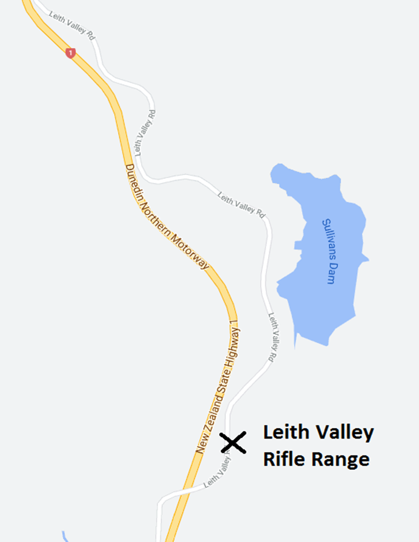

# Leith Valley Rifle Range

Open most Saturdays 1-4pm (weather permitting). The range is closed for routine maintenance in June and July and over the 
Christmas period. The range may also close at times of high fire risk. 

## 2024 Open dates

Dates       | Open/Closed | Reason              
----------- | ----------- | --------------------
6-Jan-2024  | Closed      | New Year break      
13-Jan-2024 | Closed      | New Year break      
20-Jan-2024 | Open        |                     
27-Jan-2024 | Open        |                     
3-Feb-2024  | Closed      | Waitangi Weekend            
10-Feb-2024 | Open        |                     
17-Feb-2024 | Open        |                     
24-Feb-2024 | Open        |                     
2-Mar-2024  | Open        |                     
9-Mar-2024  | Open        |                     
16-Mar-2024 | Open        |   
23-Mar-2024 | Closed      | Otago Anniversary                   
30-Mar-2024 | Closed      | Easter                    
8-Apr-2024  | Open        |               
13-Apr-2024 | Open        |                     
20-Apr-2024 | Open        |            
27-Apr-2024 | Closed      | ANZAC Day                    
4-May-2024  | Open        |                     
11-May-2024 | Open        |                     
18-May-2024 | Open        |                     
25-May-2024 | Open        |                     
1-Jun-2024  | Closed      | Winter Maintenance
8-Jun-2024  | Closed      | Winter Maintenance
15-Jun-2024 | Closed      | Winter Maintenance
22-Jun-2024 | Closed      | Winter Maintenance
29-Jun-2024 | Closed      | Winter Maintenance
6-Jul-2024  | Closed      | Winter Maintenance
13-Jul-2024 | Closed      | Winter Maintenance
20-Jul-2024 | Closed      | Winter Maintenance
27-Jul-2024 | Closed      | Winter Maintenance
29-Jul-2024 | Closed      | Winter Maintenance
3-Aug-2024  | Open        |                     
10-Aug-2024 | Open        |                     
17-Aug-2024 | Open        |                     
24-Aug-2024 | Open        |                     
31-Aug-2024 | Open        |                     
7-Sep-2024  | Open        |                     
14-Sep-2024 | Open        |                     
21-Sep-2024 | Open        |                     
28-Sep-2024 | Open        |                     
5-Oct-2024  | Open        |                     
12-Oct-2024 | Open        |                     
19-Oct-2024 | Open        |          
26-Oct-2024 | Closed      | Labour Weekend                     
2-Nov-2024  | Open        |                     
9-Nov-2024  | Open        |                     
16-Nov-2024 | Open        |                     
23-Nov-2024 | Open        |                     
30-Nov-2024 | Open        |                     
7-Dec-2024  | Open        |                     
14-Dec-2024 | Open        |            
21-Dec-2024 | Closed      | Christmas           
28-Dec-2024 | Closed      | Christmas           
31-Dec-2024 | Closed      | Christmas           
4-January   | Closed      | Christmas
11-January  | Closed      | Christmas
18-January  | Closed      | Christmas
25-January  | Open        | Range Open For 2025

## Location 

The Leith Valley Rifile Range is accessed off Leith Valley road. Either from Leith Valley or off state highway one at Leith saddle heading south. Open from 1pm to 4pm only, $5 for NZ Deerstalkers Members $10 for non-Deerstalkers							

Any cancellation due to weather or closures will be made on the [Facebook page, Leith Valley Rifle Range](https://www.facebook.com/groups/1195200207197835/). Please join this page for updates. 

The range is a 10 minute walk from the road, so make sure you are at the range well before closing time. 

Hearing protection and eye protection are mandatory. 
* Bring your earmuffs! - Hearing protection to be worn as nearing the range.
* Dogs are not permitted. 
* Smoking is not permitted. 
* Small children are not permitted for obvious safety reasons. Older children must be under the direct supervision of an adult at ALL times. 
* Adequate footwear and warm clothing is advised. 

Range Fees: 

Members **$5.00** (please bring your current membership card as proof) 
Non Members **$10.00**

Targets are supplied. 

Firing from 25, 50 and 100 meters. 

8 benches available 

Range officers can assist with sighting in. 

Safety 

* Please ALWAYS observe the SEVEN BASIC RULES of FIREARMS SAFETY. 
* Follow the direction of the Range Officers at ALL times 
* Rifles are to have bolts removed unless you are shooting. 
* Ammunition is not to be loaded in the rifle/magazine until you are stationed at the bench ready to shoot. 
* Chamber safety flags (supplied) are to be used at all times. 

Prohibited use of the range without a qualified range officer, and outside of the above hours will result in prosecution. This applies to Otago Branch NZDA members as well. Cameras are now operating at the range. 

If you are interested in becoming a Range Officer, [please contact us here](/contact-us/).
